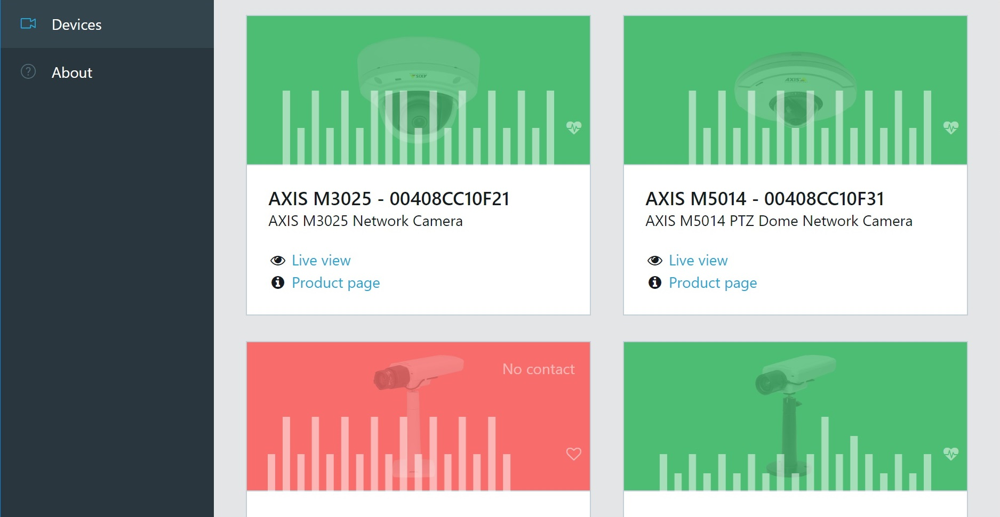

# Searchlight - A desktop application discovering Axis network video devices on your network

Searchlight is built using the latest web technologies and provides a responsive and user-friendly interface. For more information please see [https://fantasticfiasco.github.io/searchlight](https://fantasticfiasco.github.io/searchlight).

## Contributing

If you are interested in fixing issues and contributing directly to the code base, please see the document [Contributing](./.github/CONTRIBUTING.md), which covers the following:

- How to build and run from source
- Submitting pull requests
- Commit message guidelines

Please see also our [Code of Conduct](./.github/CODE_OF_CONDUCT.md).

## Feedback

- File a bug in [GitHub Issues](https://github.com/FantasticFiasco/searchlight/issues)
- [Tweet](https://twitter.com/FantasticFiasco) us with other feedback
